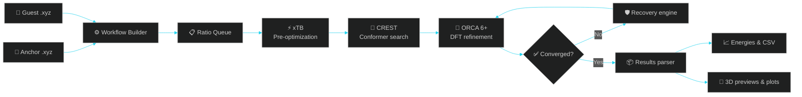

<div align="center">

<a href="https://github.com/asifverse4/ASIF_iAKv2026">
  
</a>

<a href="https://github.com/asifverse4/ASIF_iAKv2026">
  
</a>

<p>
  
  
  
</p>

<p>
  <a href="https://github.com/asifverse4/ASIF_iAKv2026/stargazers"></a>
  <a href="https://github.com/asifverse4/ASIF_iAKv2026/issues"></a>
  <a href="https://github.com/asifverse4/ASIF_iAKv2026/network/members"></a>
  
</p>

<p><strong>A resilient desktop workflow orchestrator for supramolecular complexes, host–guest systems, and isolated molecules.</strong></p>

</div>

> [!IMPORTANT]
> ASIF_iAKv2026 automates computational workflows; it does not replace method validation, chemical interpretation, or experimental confirmation.

---

## 🌌 What is ASIF_iAKv2026?

ASIF_iAKv2026 transforms a demanding multi-stage computational chemistry workflow into a clear, observable, and recoverable pipeline. It helps researchers generate starting geometries, explore conformational space, refine promising structures, and compare energetic results without manually managing every intermediate file.

<div align="center">

```text
   MOLECULES          STRUCTURE SEARCH             REFINEMENT              INSIGHT
 ┌─────────────┐     ┌───────────────┐          ┌───────────────┐        ┌─────────────┐
 │ Anchor .xyz │ ──▶ │ xTB + CREST   │ ───────▶ │ ORCA 6+ / DFT │ ─────▶ │ CSV + Graphs│
 │ Guest  .xyz │     │ Conformers    │          │ Energy parser │        │ 3D Models   │
 └─────────────┘     └───────────────┘          └───────────────┘        └─────────────┘
```

</div>

## ⚡ Core Capabilities

<table>
<tr>
<td width="50%">

### 🧬 Intelligent Chemistry

- Multi-ratio queueing: `1:0`, `1:1`, `1:2`, `1:4`
- Single-molecule and host–guest modes
- Dynamic charge and multiplicity
- Custom functional, basis-set, and solvent settings
- Automated binding-energy bookkeeping

</td>
<td width="50%">

### 🛡️ Self-Healing Execution

- Four-tier ORCA recovery strategy
- Linux `/tmp/` sandbox for safer execution
- Live `.out` log streaming
- Embedded coordinates in ORCA inputs
- Hardware-aware CPU and memory controls

</td>
</tr>
<tr>
<td width="50%">

### 📊 Interactive Analysis

- Trend Analysis & Graphs tab
- CREST versus ORCA comparisons
- Stoichiometric energy trends
- CSV report generation
- Global-minimum model organization

</td>
<td width="50%">

### 🖥️ Modern Research GUI

- Responsive split-pane interface
- Live pipeline terminal
- In-app `.xyz` 3D previews
- Dependency detection and setup
- Designed for Windows/WSL and Linux

</td>
</tr>
</table>

## 🔬 Animated Workflow Map



## 🧭 Pipeline Stages

| Stage | Engine | Purpose | Output |
|:---:|:---|:---|:---|
| `01` | **xTB** | Rapid geometry pre-optimization | Relaxed starting geometries |
| `02` | **CREST** | Conformational exploration and filtering | Candidate conformer ensemble |
| `03` | **ORCA 6+** | DFT refinement and energy evaluation | Refined structures and energies |
| `04` | **ASIF parser** | Cross-series analysis and organization | Reports, plots, and top models |

## 🧰 Technology Stack

<div align="center">


<br /><br />


</div>

## ⚙️ Requirements

- Windows 10/11 with WSL + Ubuntu, **or** native Linux
- Python **3.8+**
- OpenMPI for parallel ORCA runs
- xTB, CREST, and ORCA 6+
- Sufficient disk space for conformer ensembles and ORCA scratch files

Install OpenMPI on Ubuntu/WSL:

```bash
sudo apt update
sudo apt install openmpi-bin libopenmpi-dev -y
```

> xTB and CREST can be installed through the application. ORCA must be obtained separately from the official ORCA Forum in accordance with its license.

## 🚀 Installation

```bash
git clone https://github.com/asifverse4/ASIF_iAKv2026.git
cd ASIF_iAKv2026

python -m pip install --upgrade pip
pip install numpy matplotlib scipy
python iak_pipeline.py
```

On first launch, select **Auto-Install Missing Dependencies** for xTB and CREST. Configure the ORCA installation path when prompted.

## 🎛️ Quick Start

<details open>
<summary><strong>Run your first workflow</strong></summary>

<br />

1. **Select molecules** — choose an Anchor (A) `.xyz` file and optionally a Guest (B) `.xyz` file.
2. **Define ratios** — enter values such as `1:1, 1:2, 1:4`.
3. **Configure chemistry** — set charge, multiplicity, functional, basis set, and solvent model.
4. **Configure hardware** — provide the available cores and memory per core.
5. **Start the pipeline** — click **START BATCH PIPELINE**.
6. **Evaluate results** — inspect the live terminal, top models, CSV reports, and trend plots.

Example configuration:

```text
wB97X-D4 def2-TZVP CPCM(Water)
```

</details>

## 📁 Expected Results

```text
05_Top_Models_Comparison/
├── global_minimum_structures/
├── energy_comparison.csv
├── binding_energies.csv
├── trend_plots/
└── pipeline_logs/
```

## 📈 Research Workflow Dashboard

<div align="center">

```text
╭──────────────────────────────────────────────────────────────╮
│  ASIF_iAKv2026  •  WORKFLOW STATUS                          │
├──────────────────────────────────────────────────────────────┤
│  ● Inputs validated       ● Ratio queue prepared             │
│  ● xTB geometry relaxed   ● CREST ensemble generated         │
│  ◌ ORCA refinement        ◌ Binding energies pending         │
│  ◌ Trend plots            ◌ Top models exported              │
╰──────────────────────────────────────────────────────────────╯
```

</div>

## 🧪 Scientific Scope & Reproducibility

The structures reported by this workflow are local minima found within the selected sampling depth, RMSD filtering bounds, charge/multiplicity, and level of theory.

For defensible research conclusions:

- Validate representative structures using an appropriate higher-level method.
- Record software versions, computational settings, and hardware limits.
- Inspect suspicious geometries and convergence behavior manually.
- Treat binding energies as method-dependent quantities.
- Repeat sampling with additional seeds when the energy landscape is complex.

## 🗺️ Roadmap

- [x] Multi-ratio batch workflow
- [x] xTB → CREST → ORCA orchestration
- [x] Charge and multiplicity controls
- [x] Live output and recovery logic
- [x] Energy extraction and trend visualization
- [ ] Reproducible run manifests
- [ ] Automated benchmark datasets
- [ ] Expanded method and solvent presets
- [ ] Publication-ready report export

## 🤝 Contributing

Issues, suggestions, and feature requests are welcome.

1. Open an issue with a clear description.
2. Include your operating system, Python version, and engine versions.
3. Attach relevant logs or a minimal `.xyz` example when possible.
4. Keep pull requests focused and document changes to workflow behavior.

## 📬 Contact

- **Developer:** Asif Raza — `asifrazakne2005@gmail.com`
- **Project inspiration and guidance:** Dr. Imran A. Khan — `imranakhan@jamiahamdard.ac.in`
- **Issues:** [Open a GitHub Issue](https://github.com/asifverse4/ASIF_iAKv2026/issues)

## 📄 License

No license file is currently declared in the repository. Add a license before redistributing the project or incorporating it into another product.

<div align="center">

<a href="https://github.com/asifverse4/ASIF_iAKv2026">
  
</a>


<br />

<strong>ASIFVERSE4 · Turning complex workflows into reproducible science.</strong>

</div>
